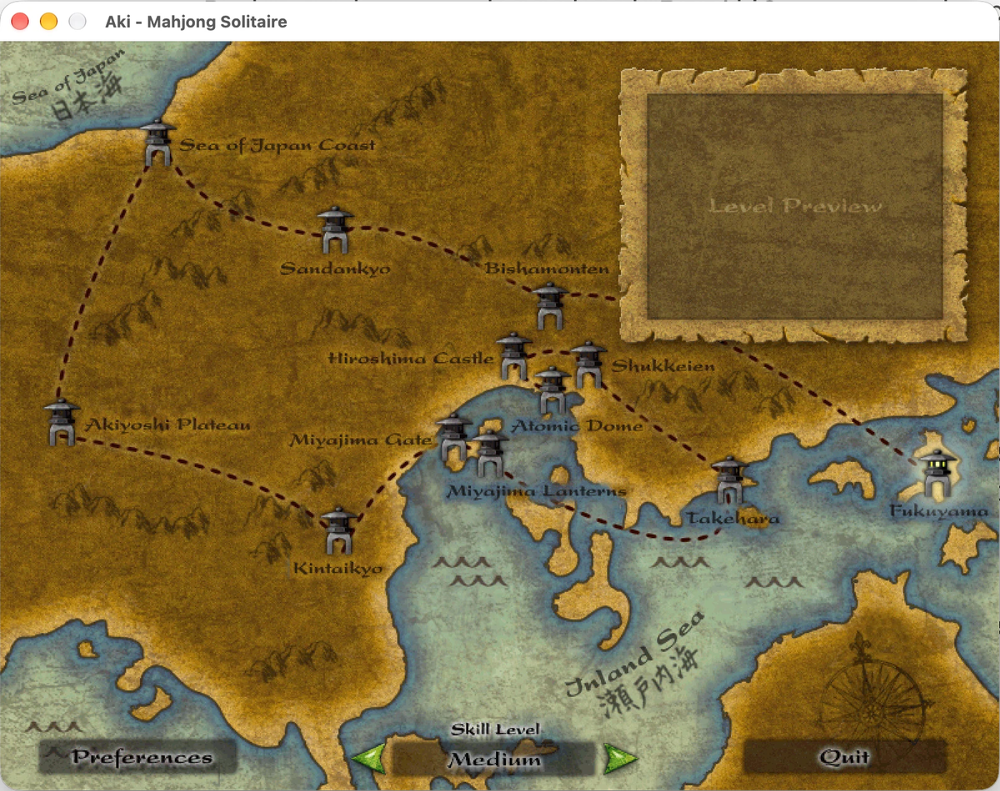
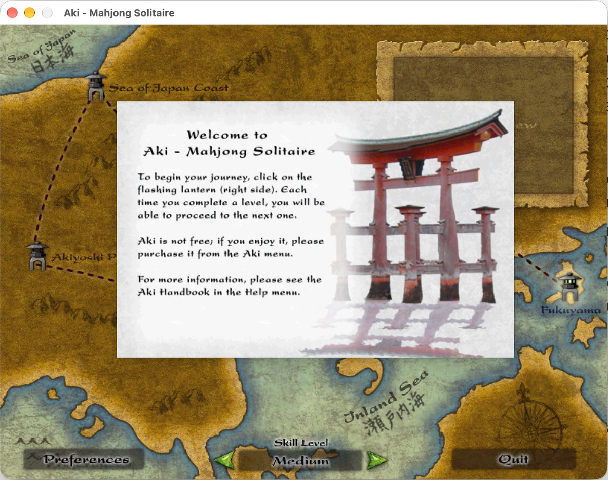
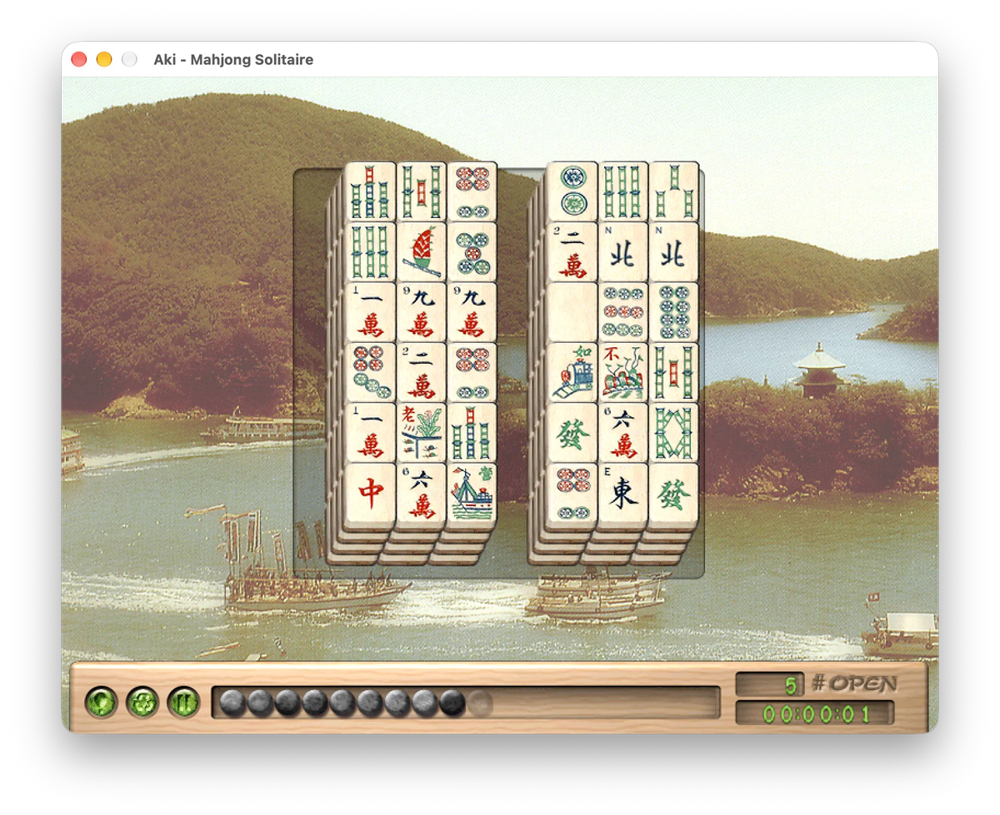

<div align="center">

# Ambrosia Classics

*Native Apple Silicon revivals of Ambrosia Software's smaller games, running on their original data.*

 &nbsp;
 &nbsp;
 &nbsp;


</div>

---

The little brother of [EV ARM](https://github.com/andiyar/ambrosia). Escape Velocity wasn't the only Ambrosia game that died with 32-bit Carbon: so did the smaller ones, the ones you'd leave open in a corner of the screen for "one more go". Same approach as EV: no source code, so the original binaries go through [Ghidra](https://ghidra-sre.org/), the behaviour gets read out of the decompile function by function, and each game is rebuilt clean in Swift on a small shared kit (HectorKit: QuickDraw-style buffers, the old resource formats, QuickTime-era sound).

The rule for every game is the same: **replicate the original 100%**. Each app loads the original pictures, sounds, strings and dialogs by their original file names, and reproduces the original's timings, rules and quirks, oddities included. No modern extras.

The list, in order: **Aki — Mahjong Solitaire** (first), **Bubble Trouble X**, then **Ferazel's Wand**, **Deimos Rising** and **Cythera**.

I just played my first game of Aki in a decade. I am so happy!

---

## Status

**Aki is playable.** Pick a lantern on the map, the map slides apart onto the level's photo, 144 tiles are dealt onto the real layout, and the stone time bar starts draining. Matching, Tip, Reshuffle, Undo, Pause, "no more pairs", the stacked ending, running out of time (with the proverb), Give Up, winning to light the next lantern, Level Statistics, and the game themes alternating are all in, on all four difficulties. Being polished now: matched pairs were vanishing instead of fading; the fix has just landed and is waiting on my eyes. Next up is Phase 3: the Level Editor and custom `.aki` level packs.

**Bubble Trouble X** is next: its game logic is being rebuilt against recordings of the original. **Ferazel's Wand, Deimos Rising and Cythera** have their reverse-engineering notes written (rules, formats, the decompiled functions mapped); no code yet.

<details>
<summary><strong>Aki milestone status</strong></summary>

### Phase 0: the shared kit ✅
- [x] HectorKit lifted out of EV ARM: resource reading, QuickDraw-style graphics, sound
- [x] Banded QuickTime PICT decoder (Aki 1.1's art), checked against every picture in the game
- [x] Data census: every Aki picture and sound opens

### Phase 1: shell, splash and map ✅
- [x] Double-click app on the original 1.2.0 data (art, sounds, strings, nibs)
- [x] Splash screens, the map with the blinking lantern and level previews, skill-level arrows
- [x] Menus from the shipped nib, Preferences, the Carbon dialogs rebuilt, Level Description
- [x] Fullscreen, the original's preferences format (and 1.1 prefs migration)
- [x] Owner's gate: "yes it absolutely is Aki"

### Phase 2: the game
- [x] The rules engine: dealing, open tiles, matching, hints, reshuffle, undo, the clock and its penalties and bonuses, statistics (107 tests)
- [x] The board drawn the way the original drew it, same buffers, same rectangles, same QuickDraw quirks
- [x] Level start and end slides, the game tick, win/loss, music and sound
- [x] Mouse, keyboard, menus, pause, Give Up, Tile Stacked, Level Statistics
- [ ] The match fade actually visible on a modern display *(fix landed, awaiting the owner's eyes)*
- [ ] Owner's gate: a level start to finish on each difficulty

### Phase 3: Level Editor and custom levels
- [ ] Level Editor, `.aki` files, Play Custom Level, Replay

</details>

---

## Screenshots

Aki 1.2.0's own art, running natively on Apple Silicon.

<table>
<tr>
<td align="center"></td>
<td align="center"></td>
</tr>
<tr>
<td align="center" colspan="2"></td>
</tr>
</table>

---

## Get it running

**No public build yet.** When there is one it'll be a double-click `.app`. For now it's source only, and you bring your own copy of Aki 1.2.

You need macOS 15+, a full Xcode install, [XcodeGen](https://github.com/yonaskolb/XcodeGen), and HectorKit checked out next to this repo (it's a local package dependency during the build-out).

```sh
cd Aki/Core && swift test                          # the rules engine
xcodegen generate && xcodebuild -scheme Aki build  # the app (project.yml is the truth; never edit the pbxproj)
tools/stage-aki.sh                                 # builds Release and copies your Aki data in → out/Aki/Aki.app
```

`stage-aki.sh` looks for the original Aki 1.2.0 app at `Resources/Aki/1.2.0.app` (a symlink is fine). No game data lives in this repo.

---

## The data, and copyright

Every picture, sound, string and dialog the apps show comes from the original games, loaded unmodified from your own copy. Content copyright stays with **Ambrosia Software** and the games' authors. The Swift code is mine; its licence file is still to come, decided at the end, as with EV ARM.

---

## Credits

- **Ambrosia Software**: for the games, of course
- **[Ghidra](https://ghidra-sre.org/)**: for reading the dead binaries
- **[The Ambrosia Archive](https://www.ambrosiaarchive.com/mac/)** and **[Macintosh Repository](https://www.macintoshrepository.org/)**: keeping the old builds downloadable
- **Claude Code**: did basically all the actual programming :)

---

<sub><em>Aki — Mahjong Solitaire, Bubble Trouble, Ferazel's Wand, Deimos Rising and Cythera © Ambrosia Software & their authors. Unofficial, non-commercial preservation, not affiliated with or endorsed by any rights holder.</em></sub>
